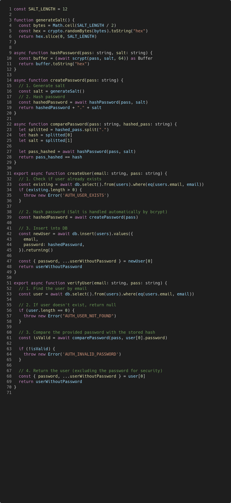
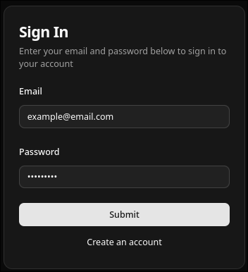
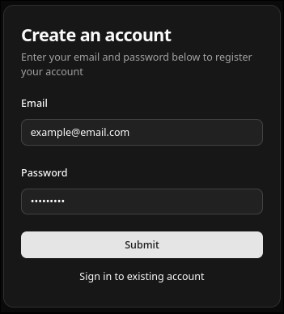
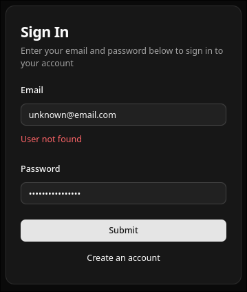
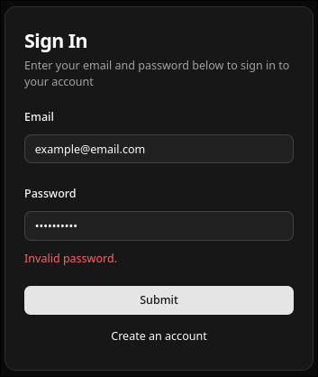
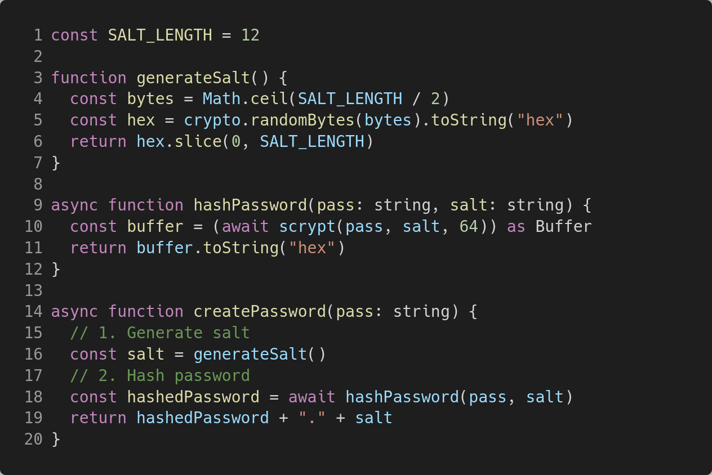
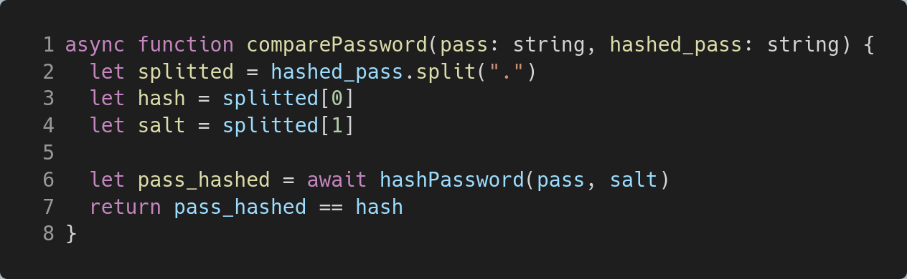
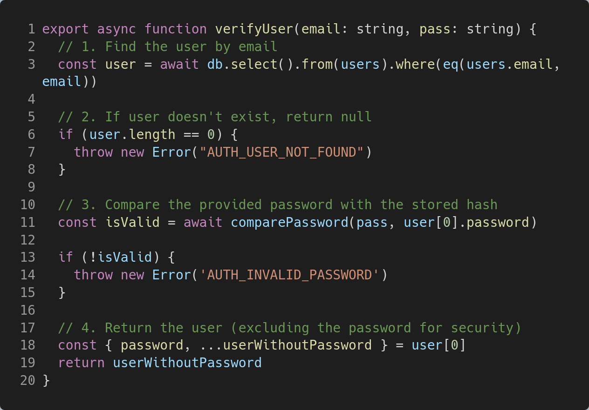

# Secure Login Form

## Developing and Running

Open terminal like **Git Bash** or any terminal.

```sh
npm install

npm run dev

# or start the server and open the app in a new browser tab
npm run dev -- --open
```

## Documentation Requirements

### 1. Screenshot of your program code



### 2. Screenshot of registration output





### 3. Screenshot of successful output


### 4. Screenshot of failed login





### 5. Explanation of how hashing works in your program (3–5 sentences)

The process of hashing the password happens in this code:



These functions uses Web Crypto API to hash the password.

it starts by generating a Salt, it first generate a random bytes with the
length "SALT_LENGTH/2", SALT_LENGTH is just a constant number. the
"crypto.randomBytes(bytes)" returns an Buffer, which is essensially an array of
bytes, toString("hex") is them used to convert the bytes into hex
representation. Which then "slice(0, SALT_LENGTH)" to guarantee that the hex
representation is SALT_LENGTH long, it will be cut off if its too long. This
hex representation is then used as a salt.

for example, "crypto.randomBytes(4)" returns "[ 87, 232, 127, 29 ]", which then
toString("hex") converts them into hex representation, hence "98fa4f86",
calling "slice(0, SALT_LENGTH)" should return the same string.

The salt (hex representation) will then be used with "crypto.scrypt(password,
salt, 64)", this will return a random hex representation in length of 64.

In the function "createPassword()", the creation off password is the
concatenation of hashed password and the salt itself, and combined with a dot
"." as a delimiter.

The example result of createPassword is
"68dde3a2d4ff31550b63f4ded2fdaf99f56fe4cb6118860bd3c9b82cd6ca5b9c2b3e7c26db890443b3c0899c6b9fd3a7d539c8c731ad9f3d522868c6ae62ee6d.887634c86afd".

"68dde3a2d4ff31550b63f4ded2fdaf99f56fe4cb6118860bd3c9b82cd6ca5b9c2b3e7c26db890443b3c0899c6b9fd3a7d539c8c731ad9f3d522868c6ae62ee6d"
is the hashed password using salt8 and "87634c86afd" is the salt itself.

### 6. Explanation of how salting improves security (3–5 sentences)

TODO: assigned: Anyone

### 7. Explanation of how password verification works (3–5 sentences)

The process of password verification works happens in this function:



It starts by spliting the "hashed_password" by delimiter which is ".", this
will result in **array** of length of 2, the first index is the password hash
and the second index is the salt itself. The second element in the **array**,
will be used as a salt to create a new password hash from "pass" variable,
using "hashPassword(pass, salt)", this should return a password hash. The last
statement is comparing the password hash from the first element in the
**array** and the newly created password hash, if to password hash matched, the
the password is correct, otherwise, its not.


## Task 3 - Analysis Questions

1. What is hashing?

TODO: assigned: Anyone

2. What is salting?

TODO: assigned: Anyone

3. Why is hashing important in cybersecurity?

TODO: assigned: Anyone

4. What would happen if passwords were stored in plaintext?

TODO: assigned: Anyone

5. How does your login system verify users?

The process of user verification happens in this function:



In the database, it has a "users" table, it has a columns "email" and
"password". The password is the password hash explained in "5. Explanation of
how hashing works in your program (3–5 sentences)" Each user is in the database
is identified by their email address.

The function "authenticateUser" should return the user itself or throwing an
exception if an error occurs or Authentication failed or the user isnt found.
First queried the database to get the user identified by "email", this should
return an array of users, if the array is empty, then the user isnt found, if
not then the user is found. The user found in the array will contains an
"email" and "password", this "password" will then be used with "pass" parameter
for "comparePassword"; explanation of "comparePassword" explained in "7.
Explanation of how password verification works (3–5 sentences)"
